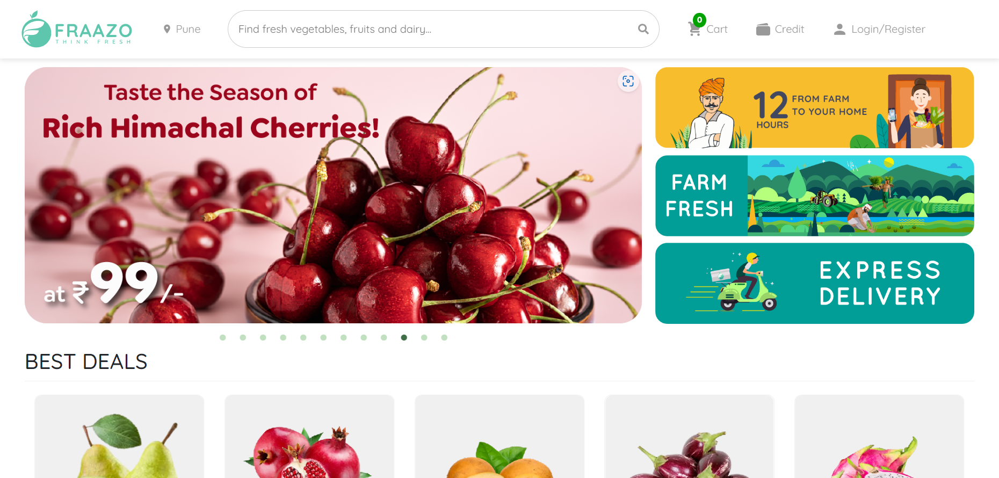
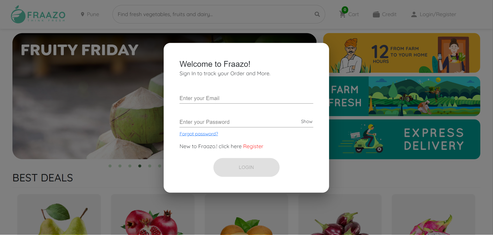
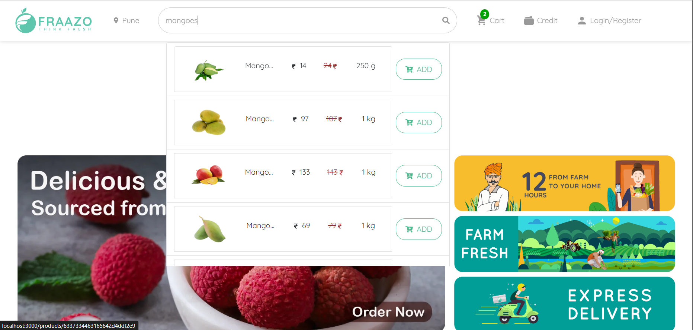
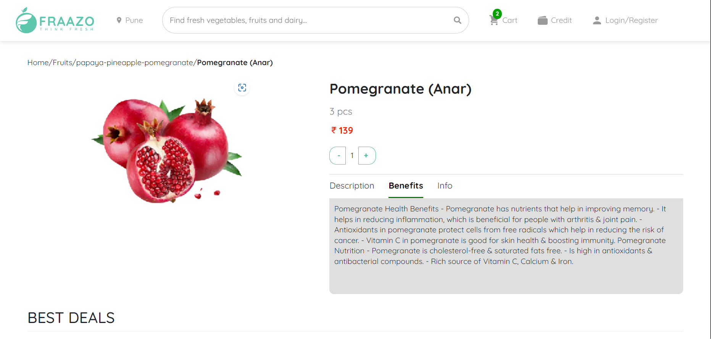
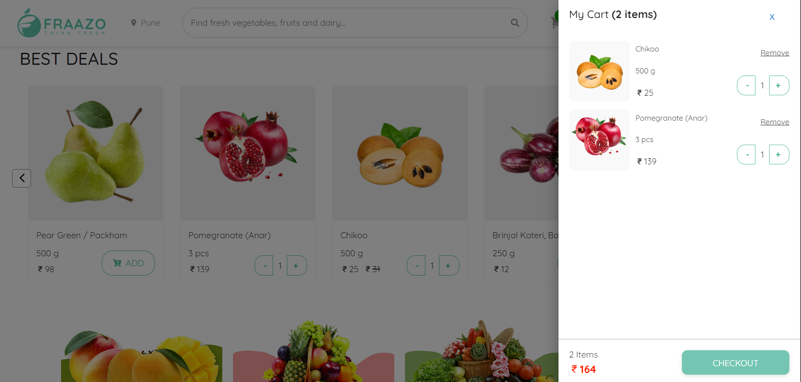

# Frazao clone
 Frazao follows a farm-to-fork model where it owns the entire back-end supply chain starting with farmers and delivers them fresh to customers.

## Acknowledgements

**Original website link**: (https://fraazo.com/)

**netlify link of our project**: (https://frazzokefall.netlify.app/)

## collaborators:
- [Prabhat Singh](https://github.com/prabhattopi)
- [Vivek Nemade](https://github.com/Vivek-Nemade)
- [Harsh Joundal](https://github.com/harshjoundal)
- [Hemant Prajapati](https://github.com/hemant069)

## Tech Stack:

<h1>Snapshots of our project</h1>

1. Landing page

 

2. Login Page

 

3. Search bar

 

4. Product Page

 

5. Cart

 
